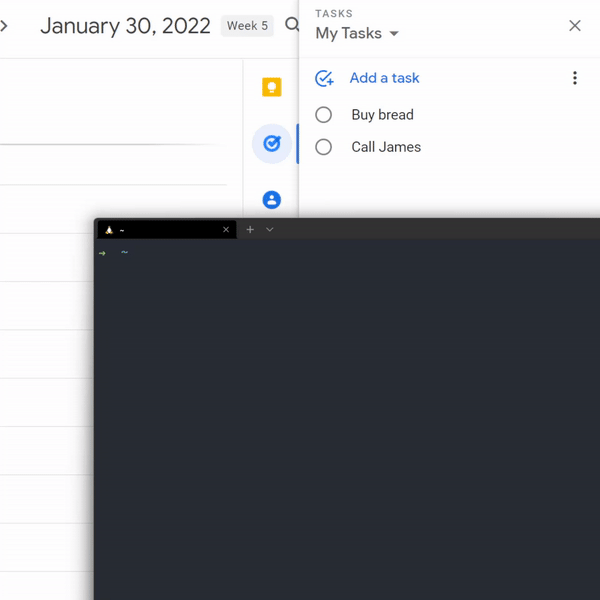

# Todo CLI 📝

A simple command-line tool for managing Google Tasks. ✨

### Increase your productivity with a simple command. 🛋

## 👾 Get Started

- Clone repo: `git clone https://github.com/MaximilianHagelstam/todo-cli.git`
- Move into project directory: `cd todo-cli`
- Install dependencies: `npm i`
- Create credentials with [this guide](https://developers.google.com/workspace/guides/create-credentials)
- Install globally by running `npm i -g .` from withing the project directory

## 🧰 Commands

| Command                     | Description                     |
| --------------------------- | ------------------------------- |
| `todo list`                 | List tasks in "My Tasks" list   |
| `todo add -t "<YOUR TODO>"` | Add new task to "My Tasks" list |
| `todo -v`                   | Check current CLI version       |
